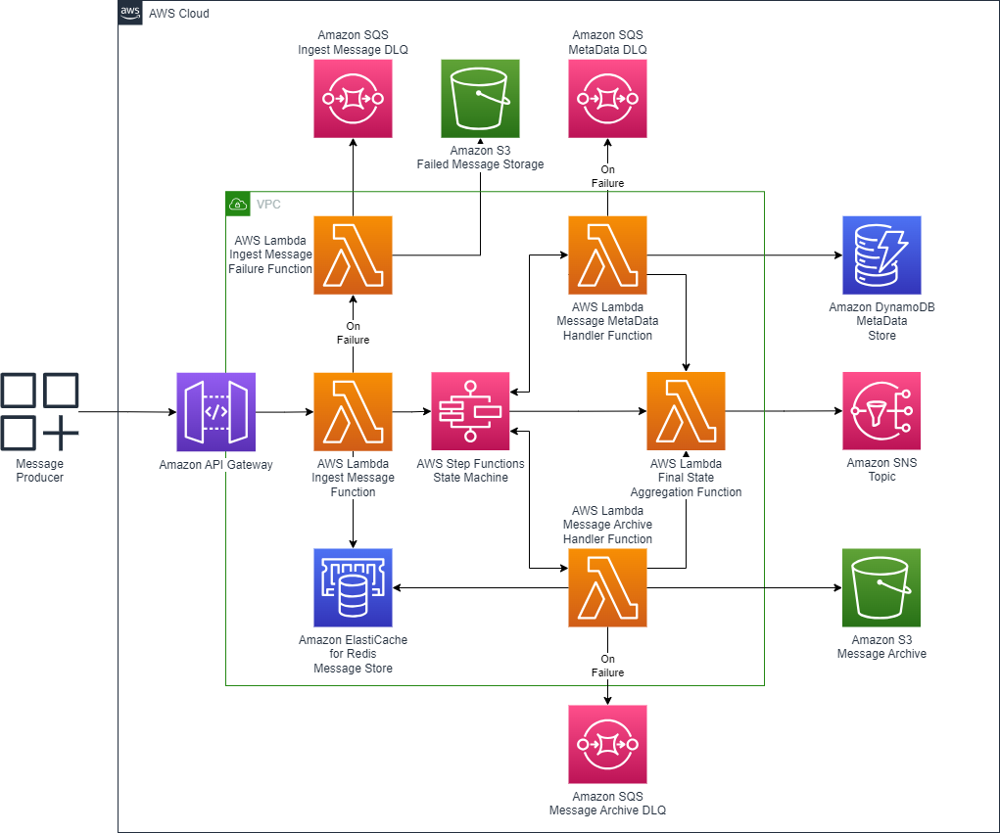

<!--
MIT No Attribution

Copyright 2023 Amazon.com, Inc. or its affiliates.

Permission is hereby granted, free of charge, to any person obtaining a copy of this
software and associated documentation files (the "Software"), to deal in the Software
without restriction, including without limitation the rights to use, copy, modify,
merge, publish, distribute, sublicense, and/or sell copies of the Software, and to
permit persons to whom the Software is furnished to do so.

THE SOFTWARE IS PROVIDED "AS IS", WITHOUT WARRANTY OF ANY KIND, EXPRESS OR IMPLIED,
INCLUDING BUT NOT LIMITED TO THE WARRANTIES OF MERCHANTABILITY, FITNESS FOR A
PARTICULAR PURPOSE AND NONINFRINGEMENT. IN NO EVENT SHALL THE AUTHORS OR COPYRIGHT
HOLDERS BE LIABLE FOR ANY CLAIM, DAMAGES OR OTHER LIABILITY, WHETHER IN AN ACTION
OF CONTRACT, TORT OR OTHERWISE, ARISING FROM, OUT OF OR IN CONNECTION WITH THE
SOFTWARE OR THE USE OR OTHER DEALINGS IN THE SOFTWARE.-->

# Building a Serverless Streaming Pipeline to Deliver Reliable Messaging

<details open="open">
<summary>Table of Contents</summary>

- [About](#about)
- [Requirements](#requirements)
- [Organization](#organization)
- [Configuration](#configuration)
- [Building and Publishing](#building-and-publishing)
- [License](#license)

</details>

## About

Please see the blog post [here](http://replace.me) for more information.

The architecture is designed for maximizing audit record ingestion performance.  This system operates between the limit of most messaging systems (256Kb to 1Mb) and the limit for Lambda functions (6Mb). The primary source of latency is the time it takes for an audit record to be transmitted across the network. An AWS Lambda function to receive the message and an Amazon ElastiCache for Redis cluster provides initial blocking persistence layer write that provides better performance than S3. Once the data is persisted in ElastiCache, the AWS Step Functions workflow then manages the orchestration of the communication and persistence functions. The architecture diagram below models the flow of the audit record through the system.



---

## Requirements

* **AWS Command Line Interface:** ([link](https://docs.aws.amazon.com/cli/latest/userguide/cli-chap-welcome.html))
* **AWS Serverless Application Model:** ([link](https://docs.aws.amazon.com/serverless-application-model/latest/developerguide/what-is-sam.html))The deployment scripts have been created with AWS Cloud Development Kit (AWS CDK) v2 [Link](https://docs.aws.amazon.com/cdk/v2/guide/home.html).  The python version of the CDK has been used
* **Python:** Python 3.10 was used during the development and deployment of the solution

_Note: This solution has been developed and tested on Windows and Amazon Linux 2_

---

## Organization

**Folder structure:**
``` bash
├── infra
├── internal-json
├── media
├── src
|   ├── commonLayer 
|   ├── finalStateAggregate 
|   ├── ingestFailure
|   ├── ingestMessage
|   ├── messageArchive
│   └── messageMetaData
├── statemachine
├── test_client
├── template.yaml
└── test_message.json
```

* ```infra``` SAM templates for VPC and Redis stack creation
* ```internal-json``` Examples of internal message payloads
* ```media``` Architecture diagram
* ```src``` Code to support Lambda functions
    * ```commonLayer``` Universal constants, exception handler, and JSON template loader code with necessary universal Python libraries
    * ```finalStateAggregate``` Builds final message to be sent to subscribers
    * ```ingestFailure``` If the initial ingestion Lambda fails, this Lambda salvages the raw message and writes it to a S3 bucket
    * ```ingestMessage``` Main lambda process that receives the message from the client (via the API gateway), writes the payload to Redis, and initiates the Step Function
    * ```messageArchive``` Stores the message payload in S3 from Redis
    * ```messageMetaData``` Stores the meta data about the message in DynamoDB
* ```statemachine``` Contains the JSON definition of the State Machine
* ```test_client``` Code and sample payload to exercise the API gateway and test the stack
* ```template.yaml``` Primary SAM definition that will create the stack

---

## Building and Publishing

__Prerequisites__

* An Amazon account to deploy the stack into
* Credentials with AWS Region configured with permissions necessary to run SAM script (see [AWS CLI documentation](https://docs.aws.amazon.com/cli/latest/userguide/cli-chap-configure.html))

__The following commands will build and deploy the stack__

``` bash
cd <project directory>

sam build
sam deploy --guided
```

---

## Configuration

The SAM script will ask for the following configuration items:

* __ElasticacheInstanceClass__ What EC2 instance type to use with AWS ElastiCache Redis cluster.  Recommend ```cache.t3.small``` for low volume testing
* __ElasticReplicaCount__ How many instances/replicas of the ElastiCache to create.  Recommend ```2```
* __ProjectName__ Name to use with VPC naming. _No recommendation_
* __MultiAZ__ Configure Redis to use MultiAZ deployment configuration.  Recommend ```true```

---

## License

MIT No Attribution

Copyright 2023 Amazon.com, Inc. or its affiliates.

Permission is hereby granted, free of charge, to any person obtaining a copy of this software and associated documentation files (the "Software"), to deal in the Software without restriction, including without limitation the rights to use, copy, modify, merge, publish, distribute, sublicense, and/or sell copies of the Software, and to permit persons to whom the Software is furnished to do so.

THE SOFTWARE IS PROVIDED "AS IS", WITHOUT WARRANTY OF ANY KIND, EXPRESS OR IMPLIED, INCLUDING BUT NOT LIMITED TO THE WARRANTIES OF MERCHANTABILITY, FITNESS FOR A PARTICULAR PURPOSE AND NONINFRINGEMENT. IN NO EVENT SHALL THE AUTHORS OR COPYRIGHT HOLDERS BE LIABLE FOR ANY CLAIM, DAMAGES OR OTHER LIABILITY, WHETHER IN AN ACTION OF CONTRACT, TORT OR OTHERWISE, ARISING FROM, OUT OF OR IN CONNECTION WITH THE SOFTWARE OR THE USE OR OTHER DEALINGS IN THE SOFTWARE.